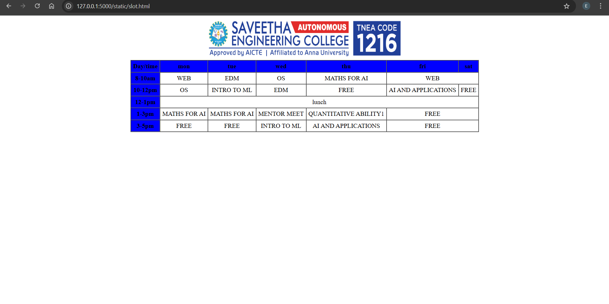

# Ex03 Time Table
## Date:
26/9/2025
## AIM
To write a html webpage page to display your slot timetable.

## ALGORITHM
### STEP 1
Create a Django-admin Interface.

### STEP 2
Create a static folder and inert HTML code.

### STEP 3
Create a simple table using ```<table>``` tag in html.

### STEP 4
Add header row using ```<th>``` tag.

### STEP 5
Add your timetable using ```<td>``` tag.

### STEP 6
Execute the program using runserver command.

## PROGRAM
    <!DOCTYPE html>
    <html lang="en">
    <head>
    <title>Timetable</title>
    </head>
    <body>
    <center>
        
    </center>

    <table border="1" align="center" cellspacing="0" cellpadding="5">
        <tr bgcolor="blue" align="center">
            <th>Day/time</th>
            <th>mon</th>
            <th>tue</th>
            <th>wed</th>
            <th>thu</th>
            <th>fri</th>
            <th>sat</th>
        </tr>
        <tr align="center">
            <th bgcolor="blue">8-10am</th>
            <td>WEB</td>
            <td>EDM</td>
            <td>OS</td>
            <td>MATHS FOR AI</td>
            <td colspan="2">WEB</td>
        </tr>
        <tr align="center">
            <th bgcolor="blue">10-12pm</th>
            <td>OS</td>
            <td>INTRO TO ML</td>
            <td>EDM</td>
            <td>FREE</td>
            <td>AI AND APPLICATIONS</td>
            <td>FREE</td>
        </tr>
        <tr align="center">
            <th bgcolor="blue">12-1pm</th>
            <td colspan="6">lunch</td>
        </tr>
        <tr align="center">
            <th bgcolor="blue">1-3pm</th>
            <td>MATHS FOR AI</td>
            <td>MATHS FOR AI</td>
            <td>MENTOR MEET</td>
            <td>QUANTITATIVE ABILITY1</td>
            <td colspan="2">FREE</td>
        </tr>
        <tr align="center">
            <th bgcolor="blue">3-5pm</th>
            <td>FREE</td>
            <td>FREE</td>
            <td>INTRO TO ML</td>
            <td>AI AND APPLICATIONS</td>
            <td colspan="2">FREE</td>
        </tr>
     </table>
    </body>
    </html>

## OUTPUT


## RESULT
The program for creating slot timetable using basic HTML tags is executed successfully.
